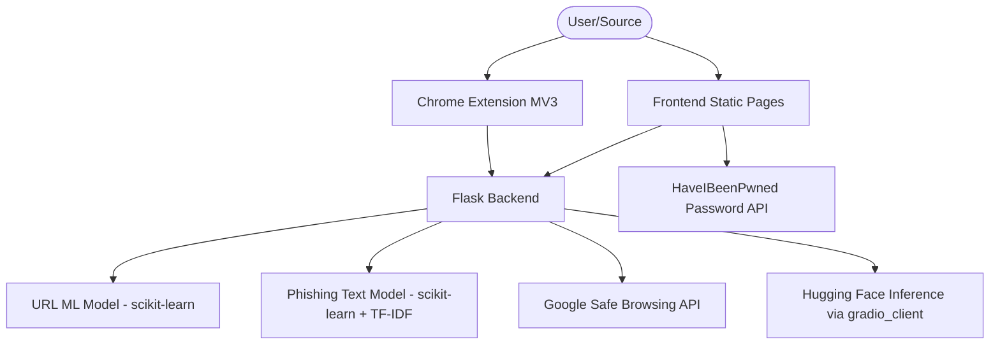

# NetShield

**Your AI-Powered Shield Against Digital Threats**

NetShield (formerly CodeGuardians) is a comprehensive cybersecurity command center designed to protect users from modern digital threats. It unifies detection engines for AI-generated deepfakes, phishing attacks, malicious URLs, and unsafe commands into a single platform.

## Core Features

### 1. AI Image Detection
**Goal:** Detect AI-generated images, deepfakes, and synthetic media.
- **Technology:** Hugging Face-hosted inference integrated through `gradio_client`
- **How it works:**
  - Sends uploaded image input to the configured AI detection endpoint.
  - Returns prediction label with confidence score.

### 2. Phishing Email Detector
**Goal:** Analyze emails and messages to detect social engineering and phishing attempts.
- **Technology:** Hybrid approach (ML + Rules + URL Analysis)
- **Features:**
  - **ML Model:** TF-IDF vectorization with a saved scikit-learn phishing classifier.
  - **Rule-Based Engine:** Detects urgency and social-engineering keywords.
  - **URL Scanner:** Extracts links and validates each URL with ML + Google Safe Browsing.

### 3. URL Safety Scanner
**Goal:** Verify if a website link is safe before clicking.
- **Technology:** Hybrid service (Custom URL ML Model + Google Safe Browsing API)
- **Features:**
  - **Machine Learning Analysis:** Lexical/structural URL feature-based detection.
  - **Real-time Verification:** Cross-checks links with Google Safe Browsing.
  - **Combined Verdict:** Returns a final risk status for user action.

### 4. Dangerous Command Analysis
**Goal:** Help users avoid risky shell commands.
- **Technology:** Static analysis and pattern matching
- **How it works:**
  - Detects destructive and suspicious shell patterns.
  - Flags escalation/network/obfuscation risk patterns.

### 5. Password Toolkit
**Goal:** Generate strong passwords and check breach exposure.
- **Technology:** Cryptographically secure RNG + HaveIBeenPwned API
- **Features:**
  - **Generator:** Configurable high-entropy password generation.
  - **Strength Meter:** Real-time complexity feedback.
  - **Breach Check:** k-Anonymity password leak lookup.

### 6. Browser Extension
**Goal:** Real-time support while browsing.
- **Technology:** Chrome Extension Manifest V3 (JavaScript/HTML/CSS)
- **Features:**
  - Password-field detection support.
  - Popup utilities for phishing and password-related actions.

---

## Tech Stack

### System Architecture



### Front-end (`frontend/`)
- **HTML5 Pages:** Multi-page interface in `frontend/pages`.
- **Vanilla JavaScript:** Feature logic in `frontend/js`.
- **CSS3:** Shared styles in `frontend/css/style.css` with static assets in `frontend/assets`.

### Browser Extension (`extension/`)
- **Manifest V3:** Defined in `extension/manifest.json`.
- **Modules:** `background/`, `content/`, `popup/`, and `utils/`.

### Back-end (`backend/`)
- **Flask (Python 3):** App entry and routing in `backend/app.py`.
- **Services:** Modular detection/safety services in `backend/services`.
- **Server & Deployment:** `gunicorn`, `Procfile`, and `vercel.json`.
- **Config:** Environment loading through `python-dotenv`.

### ML / AI
- **Stored Models:** `.pkl` files in `backend/model` loaded via `joblib`.
- **Training Utilities:** Model/data scripts in `backend/utils`.
- **Libraries:** scikit-learn, pandas, Pillow.
- **Image AI Integration:** Hugging Face endpoint client via `gradio_client`.

### External Integrations
- **Google Safe Browsing API**
- **HaveIBeenPwned API (k-Anonymity range endpoint)**

## Installation & Setup

### Prerequisites
- Python 3.8 or higher

### 1. Clone the Repository
```bash
git clone https://github.com/athrvas017/Code_Guardians.git
cd Code_Guardians
```

### 2. Create Virtual Environment
```bash
python -m venv venv
```

### 3. Activate Virtual Environment
```bash
# Windows (PowerShell)
.\venv\Scripts\Activate.ps1

# Windows (Command Prompt)
.\venv\Scripts\activate.bat

# Linux/macOS
source venv/bin/activate
```

### 4. Install Dependencies
```bash
pip install -r backend/requirements.txt
```

### 5. Set Environment Variables
Create a `.env` file in the project root (or use `.env.example`) and set:
- `GOOGLE_API_KEY`
- `HF_API_URL`
- `HF_API_TOKEN` (if required by your HF endpoint)
- `SECRET_KEY` (optional)

## Running the Application

### Start the Backend Server
```bash
cd backend
python app.py
```
The app runs on `http://127.0.0.1:5000` by default.

### Navigation
| Route | Feature |
|-------|---------|
| `/` | Home / Dashboard |
| `/ai-detection` | AI Image Detection |
| `/phishing` | Phishing Detector |
| `/url-safety` | URL Safety Checker |
| `/password` | Password Toolkit |
| `/awareness` | Cyber Awareness Guide |
| `/command-analysis` | Dangerous Command Analysis |

## Project Structure
```text
Code_Guardians/
|-- backend/
|   |-- app.py
|   |-- requirements.txt
|   |-- model/             # Trained .pkl models/vectorizers
|   |-- services/          # Detection and safety services
|   |-- templates/         # Flask templates
|   `-- utils/             # Training and feature utilities
|-- frontend/
|   |-- pages/             # Static HTML pages
|   |-- js/                # Frontend scripts
|   |-- css/
|   `-- assets/
|-- extension/
|   |-- manifest.json
|   |-- background/
|   |-- content/
|   |-- popup/
|   `-- utils/
`-- README.md
```

## Roadmap Snapshot
- **Partially Implemented:** Database layer integration, password manager module.
- **Future Enhancements:** Advanced password manager, improved URL model, improved AI image model.
